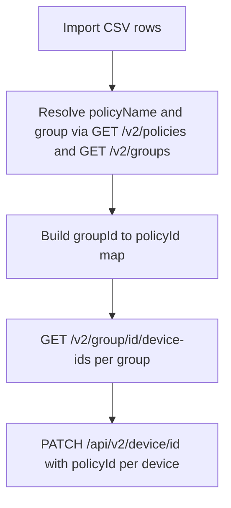

# Policy mapping by group (CSV)

Bulk-assign a NinjaOne **policy** to **every device** in one or more **groups**, driven by a CSV file. Policy and group names are resolved to IDs via the API before each device is updated.

Evaluate and test in a controlled setting before use in production. Run with **`-WhatIf`** first to preview changes.

## Related scripts

| Script | Scope |
|--------|--------|
| [Set-NinjaDevicePolicyForGroup.ps1](../Set-NinjaDevicePolicyForGroup.ps1) | Single group; numeric `GroupId` and `PolicyId` |
| [Policy Mapping/](../../Policy%20Mapping/) | Organization-level policy assignments **by device role** (different API and CSV columns) |
| [Update-DeviceNinjaAPI/README.md](../README.md) | Shared credentials, OAuth paths, and troubleshooting for all device-update scripts in this folder |

## Files in this folder

| File | Role |
|------|------|
| `Set-NinjaDevicePolicyForGroupFromCsv.ps1` | Main script |
| `Set-NinjaDevicePolicyForGroup-Example.csv` | Example mappings (use names from your tenant) |
| `README.md` | This documentation |

## How it works



- **groupId wins** when non-empty; `groupName` is ignored for that row.
- **Duplicate groups:** if the same group appears in multiple rows, the **last** row wins.
- **Blank rows** (all three columns empty) are skipped.
- **Resolve failures** (unknown policy/group, invalid `groupId`) are collected and the script exits with code **2** before any device PATCH.

## Requirements

- PowerShell **5.1** or later (`#Requires -Version 5.1`).
- OAuth **client credentials** (machine-to-machine) with **monitoring** and **management** scopes.

Create an API client in NinjaOne under **API Services (machine-to-machine)** with the **Client Credentials** grant. Do not hardcode secrets in the script.

### Credentials

- **Parameters:** `-NinjaOneClientId`, `-NinjaOneClientSecret`, optional `-NinjaOneInstance`
- **Environment variables:** `NINJA_CLIENT_ID`, `NINJA_CLIENT_SECRET`, optional `NINJA_BASE_URL`

See [Update-DeviceNinjaAPI/README.md](../README.md) for base URL defaults and **`-UseWsPaths`** when the token endpoint returns 405.

## CSV format

The CSV must include these column headers (matched case-insensitively): **policyName**, **groupName**, **groupId**.

| Column | Per row | Notes |
|--------|---------|-------|
| **policyName** | Required | Resolved via `GET /v2/policies` (exact match, then case-insensitive) |
| **groupName** | If **groupId** is empty | Resolved via `GET /v2/groups` |
| **groupId** | If non-empty | Positive integer; **takes precedence** over **groupName** |

Each data row must have a non-empty **policyName** and at least one of **groupName** or **groupId**.

### Example (generic)

```csv
policyName,groupName,groupId
Windows Workstation Policy,All Workstations,
Windows Server Policy,,42
Contoso Desktop Policy,Legacy Servers,15
```

- Row 1: group resolved by name only.
- Row 2: uses `groupId` 42 (`groupName` empty).
- Row 3: uses `groupId` 15 even though `groupName` is present.

For a sample tied to a real instance, see **Set-NinjaDevicePolicyForGroup-Example.csv** in this folder and replace policy/group names with values from your tenant.

## Parameters

| Parameter | Required | Description |
|-----------|----------|-------------|
| **CsvPath** | Yes* | Path to the CSV file |
| **NinjaOneInstance** | No | Hostname or base URL. Default: `NINJA_BASE_URL` or `https://app.ninjarmm.com` |
| **NinjaOneClientId** | No* | OAuth client ID. Default: `NINJA_CLIENT_ID` |
| **NinjaOneClientSecret** | No* | OAuth client secret. Default: `NINJA_CLIENT_SECRET` |
| **WhatIf** | No | Preview device updates without calling PATCH |
| **UseWsPaths** | No | Use `/ws/oauth/token` instead of `/oauth/token` (some instances) |
| **ThrottleMs** | No | Delay in ms between each device PATCH (default `0`). Use `200`–`500` for large groups |

\* Either pass credentials as parameters or set environment variables. **CsvPath** can be omitted if you set **`$LocalCsvPath`** near the top of the script (useful for IDE F5 or dot-source runs).

### Invocation note

The script body does not include a top-level **`param()`** block (unlike [Set-NinjaDevicePolicyForGroup.ps1](../Set-NinjaDevicePolicyForGroup.ps1)). Parameters are documented in comment-based help. If named parameters such as **`-CsvPath`** fail at runtime, either:

- Set **`$LocalCsvPath`** in the script and run without **`-CsvPath`**, or
- Add the same `[CmdletBinding(SupportsShouldProcess)] param(...)` block as the single-group script so CLI examples work as written.

## Usage

```powershell
cd ".\Update-DeviceNinjaAPI\Policy Mapping by Group CSV"

$env:NINJA_CLIENT_ID = 'your-client-id'
$env:NINJA_CLIENT_SECRET = 'your-client-secret'

# Preview (no PATCH)
.\Set-NinjaDevicePolicyForGroupFromCsv.ps1 -CsvPath .\Set-NinjaDevicePolicyForGroup-Example.csv -WhatIf

# Apply mappings
.\Set-NinjaDevicePolicyForGroupFromCsv.ps1 -CsvPath .\mapping.csv

# Throttle PATCH calls for large groups
.\Set-NinjaDevicePolicyForGroupFromCsv.ps1 -CsvPath .\mapping.csv -ThrottleMs 300

# Regional instance requiring /ws/oauth/token
.\Set-NinjaDevicePolicyForGroupFromCsv.ps1 -CsvPath .\mapping.csv -NinjaOneInstance ca.ninjarmm.com -UseWsPaths
```

## API endpoints

| Step | Method | Path |
|------|--------|------|
| Token | POST | `/oauth/token` or `/ws/oauth/token` (with **`-UseWsPaths`**) |
| List groups | GET | `/v2/groups` |
| List policies | GET | `/v2/policies` |
| Group devices | GET | `/v2/group/{groupId}/device-ids` |
| Update device | PATCH | `/api/v2/device/{deviceId}` (body: `{ "policyId": <id> }`) |

## Output

The script writes one object per group to the pipeline:

**GroupId**, **PolicyId**, **PolicyName**, **TotalDevices**, **UpdatedCount**, **FailedCount**, **FailedDeviceIds**

When any device PATCH fails, failed IDs are reported and the script exits with code **1**.

## Exit codes

| Code | Meaning |
|------|---------|
| 0 | Success (all device updates succeeded, or groups had no devices) |
| 1 | Auth failure, API failure, or one or more device updates failed |
| 2 | Validation error (missing credentials, bad CSV, or name/ID resolve errors) |

## Troubleshooting

| Issue | Action |
|-------|--------|
| Token request **405** | Use **`-UseWsPaths`** (see [parent README](../README.md)) |
| Resolve errors before any PATCH | Fix policy/group names or **groupId** in the CSV; re-run |
| Rate limits on large groups | Use **`-ThrottleMs`** (e.g. `300`) |
| **`-CsvPath`** not recognized | Set **`$LocalCsvPath`** in the script or add a **`param()`** block |
