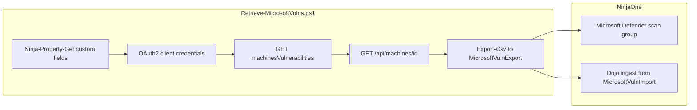

# Automated Vulnerability Export and Import: Microsoft Defender → NinjaOne

**Note** This process may require some modification to work in your setup. It was tested using Defender for Endpoint Plan 2. It is a "best effort" approach and does not fall within the scope of standard NinjaOne support.

This repository supports a fully automated workflow for **retrieving vulnerability data from Microsoft Defender for Endpoint via API**, formatting it for NinjaOne, and **importing it into NinjaOne automatically** using the NinjaOne API.

The process allows you to maintain up-to-date vulnerability data inside NinjaOne without manual exports or uploads.

For broader context on the two-script workflow, see [Vulnerability Import/ReadMe.MD](../ReadMe.MD).

Video Walkthrough: TK

---

## 🎥 Overview

This README accompanies a walkthrough video by **Jeff Hunter**, Field CTO at **NinjaOne**, demonstrating how to import vulnerability data from **Microsoft Defender for Endpoint** into NinjaOne.

The workflow demonstrates how to:

1. **Register an Entra application** and grant Defender API permissions.  
2. **Store credentials** in NinjaOne custom fields on your API server.  
3. **Retrieve vulnerabilities** from Defender, resolve machine details, and export a CSV.  
4. **Create a Microsoft Defender scan group** and import vulnerabilities into NinjaOne.  
5. **Automate** retrieval and ingest on a schedule.

---

## 🧠 Prerequisites

Before starting, make sure you have:

1. **API Server Set Up**  
   This process relies on the [NinjaOne API Server / Automated Documentation Framework](https://docs.mspp.io/ninjaone-auto-documentation/getting-started) created by **Luke Whitelock**.  
   - 📖 [Setup Guide](https://docs.mspp.io/ninjaone-auto-documentation/getting-started)  
   - 🎥 [Video Walkthrough](https://www.youtube.com/watch?v=Qy9g6-KVfbo)

2. **Microsoft Entra App Registration**  
   See [Setup Steps](#setup-steps) for detailed registration. Application permissions on **WindowsDefenderATP**:
   - `Vulnerability.Read.All` — fetch CVEs from `/api/vulnerabilities/machinesVulnerabilities`
   - `Machine.Read.All` — resolve `machineId` to hostname, IP, and MAC via `/api/machines/{id}`  

   Grant **admin consent** for the tenant. Without admin consent, API calls return 403 Forbidden.

3. **NinjaOne Custom Fields**  
   Create three device custom fields on your API server. The **field API names** must match exactly (used by `Ninja-Property-Get` in the script):
   - `entraTenantId` — Text, read/write from automations, read-only to technicians
   - `entraClientId` — Text, same access settings
   - `entraClientSecret` — Secure/password field (masked in the UI)

   > If you use different field API names, update [Retrieve-MicrosoftVulns.ps1](Retrieve-MicrosoftVulns.ps1) to match.

4. **Microsoft Defender for Endpoint API Access**  
   The script connects to: **https://api.securitycenter.microsoft.com**

5. **Local Folders**  
   - Export (Script 1): **C:\MicrosoftVulnExport** (created automatically if missing)  
   - Ingest (Script 2 / Dojo): **C:\MicrosoftVulnImport**

---

## Repository Scripts

- **Script 1 (this repository)**: [Retrieve-MicrosoftVulns.ps1](Retrieve-MicrosoftVulns.ps1) — Retrieves Defender vulnerabilities via API, resolves machine details, and writes `DefenderVulnerabilities.csv`.
- **Script 2 (NinjaOne Dojo article)**: Ingests the CSV produced by Script 1 into NinjaOne via API.  
  Link: https://ninjarmm.zendesk.com/hc/en-us/articles/35563969789581-NinjaOne-Vulnerability-Management-Automating-the-Vulnerability-Import-Process

> The retrieval/formatting (Script 1) is vendor-specific; the ingest script (Script 2) is shared across scanners.

---

## Setup Steps

### 1) Register an Application in Entra

Sign in to the **Entra** portal as a Global Administrator or Application Administrator.

1. Navigate to **App registrations** → **New registration**
2. Configure:
   - **Name:** `NinjaOne-DefenderAPI` (or similar)
   - **Supported account types:** Accounts in this organizational directory only (single tenant)
   - **Redirect URI:** Leave blank — client credentials flow does not require a redirect
3. Click **Register**, then copy the **Application (client) ID** and **Directory (tenant) ID**

### 2) Grant WindowsDefenderATP Application Permissions

In the app registration:

1. **API permissions** → **Add a permission** → **APIs my organization uses** → search **WindowsDefenderATP**
2. Select **Application permissions** and add:
   - `Vulnerability.Read.All`
   - `Machine.Read.All`
3. Click **Grant admin consent for [your tenant]** and confirm both permissions show a green checkmark

### 3) Create a Client Secret

1. **Certificates & secrets** → **Client secrets** → **New client secret**
2. Add a description (e.g., `NinjaOne-Defender`) and choose an expiry (12 or 24 months is typical)
3. **Copy the secret Value immediately** — Entra will not show the full value again after you leave the page

> Never commit secrets to source control or hard-code them in the script body.

### 4) Store Credentials in NinjaOne Custom Fields

1. Go to **Administration → Devices → Custom Fields** and create the three fields listed in Prerequisites (`entraTenantId`, `entraClientId`, `entraClientSecret`)
2. Go to **Roles** → expand your API server role (e.g., **Windows Server**) → **Edit** → **API Creds** tab
3. Add the three Entra custom fields to the tab
4. On your **API server device** → **Custom** → **API Creds** → enter tenant ID, client ID, and client secret → **Save**

### 5) Import Script 1 (Retrieve + Format)

1. Add [Retrieve-MicrosoftVulns.ps1](Retrieve-MicrosoftVulns.ps1) to **Administration → Library → Automation**
2. Confirm the default export path: `C:\MicrosoftVulnExport\DefenderVulnerabilities.csv` (override with `-OutputPath` if needed)
3. Optional parameters: `-Severity` (`Critical`, `High`, `Medium`, `Low`), `-DebugMode`

The script reads credentials from `Ninja-Property-Get` and creates `C:\MicrosoftVulnExport` if it does not exist.

### 6) Create CSV Export (Initial Run)

On your API server, run **Retrieve-MicrosoftVulns.ps1**. When complete, confirm `C:\MicrosoftVulnExport\DefenderVulnerabilities.csv` exists (download via file explorer if validating remotely).

### 7) Choose Device Matching Fields

Open the CSV and decide how Defender devices map to NinjaOne devices.

- **Hostname** (recommended in the walkthrough): map CSV `Hostname` to NinjaOne **Host Name**. Ensure no duplicate hostnames in your environment to avoid mis-assigned vulnerabilities.
- **MAC address / IP address** are exported but can change (multiple adapters, VPNs, docked laptops switching networks).

### 8) Import into NinjaOne (Scan Group)

Before automating, create a scan group for the numeric **Scan Group ID**:

1. **Administration → Apps** → **Add App** → enable **Microsoft Defender**
2. Open **Scan groups** → **Create scan group**
3. Name the group, upload `DefenderVulnerabilities.csv` from `C:\MicrosoftVulnExport`
4. **Device Identifier:** `Hostname` (or your chosen column)
5. **CVE Identifier:** `CVE_ID`
6. Complete the import

> Defender exports are CVE-native (one row per machine/CVE). Imported row counts should align closely with the export.

### 9) Automate the Import

1. Import the Dojo ingest script from [Script 2](#repository-scripts) into NinjaOne
2. Get the scan group ID: **Administration → Apps → API** → API documentation tooltip → search **Vulnerability Management** → **Fetch all scan groups** → note the ID for your Microsoft Defender scan group
3. Configure the ingest script:
   - `$ScanGroupID` — numeric ID from step 2
   - `$PathtoCSV` — `C:\MicrosoftVulnImport`
   - `$CSVName` — `DefenderVulnerabilities`
   - Regional base URL for your NinjaOne instance (e.g., `ca.ninjarmm.com`)
4. **Administration → Policies** → API server policy → **Scheduled Automations** → add one automation that runs, in order:
   1. `Retrieve-MicrosoftVulns.ps1`
   2. Dojo ingest script  
   Schedule after your Defender exposure refresh cadence (e.g., daily).

---

## CSV Requirements (NinjaOne)

NinjaOne expects the following:

- Each **unique CVE ID** must appear on **its own row**.  
- Any row **without a CVE ID** will be **rejected**.

**Script 1 output columns:**

| Column | Source / purpose |
|--------|------------------|
| Hostname | `computerDnsName` (fallback: `machineId`) |
| IPAddress | Active interfaces (`operationalStatus = Up`) or `lastIpAddress` |
| MACAddress | Active interfaces |
| MachineId | Defender machine GUID |
| CVE_ID | `cveId` |
| Severity | Critical / High / Medium / Low |
| ProductVendor | Affected software vendor |
| ProductName | Affected product name |
| ProductVersion | Affected product version |
| FixingKB | `fixingKbId` |

**Import mapping:**

| NinjaOne field | CSV column |
|----------------|------------|
| Device Name | `Hostname` |
| CVE ID | `CVE_ID` |

**Example schema (NinjaOne view):**

| Device Name | CVE ID        | Severity | Description              | Vendor             |
|--------------|---------------|----------|--------------------------|--------------------|
| WIN-01       | CVE-2025-1234 | High     | (from product fields)    | Microsoft Defender |
| WIN-01       | CVE-2025-4321 | Medium   | (from product fields)    | Microsoft Defender |

---

## Operational Notes

- **Credentials:** Loaded from NinjaOne custom fields `entraTenantId`, `entraClientId`, `entraClientSecret` on the API server device.
- **Pagination:** Vulnerabilities are fetched from `/api/vulnerabilities/machinesVulnerabilities` in pages of up to 10,000 records via `@odata.nextLink`.
- **Machine resolution:** One API call per unique `machineId`; the script pauses 1 second after every 50 lookups (~100 requests/minute guidance).
- **Severity filter:** `-Severity` applies an OData `$filter` server-side.
- **Runtime:** Large tenants may take several minutes due to per-machine lookups.

---
